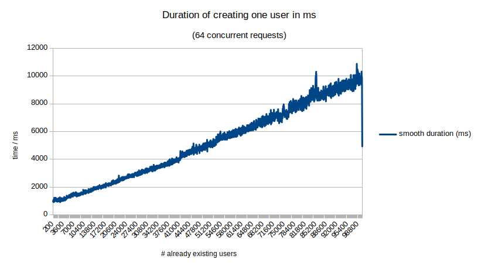
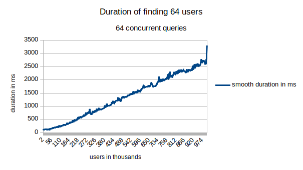
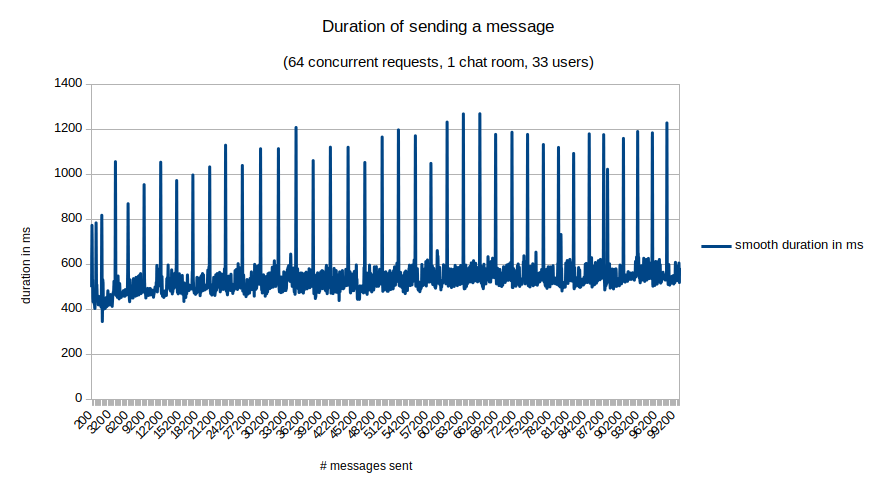
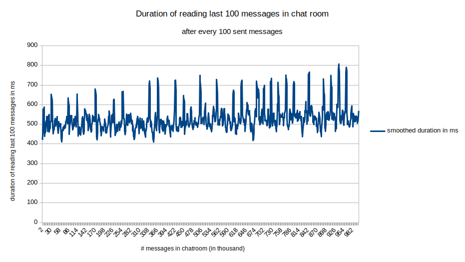

Rocket.Chat Skalierungs-Tests
=============================

Dieses Projekt misst, wie der Rocket.Chat-Server bei großen Datenbeständen skaliert. Die Messung der Effekte von vielen parallelen Nutzern ist in einem anderen Projekt beheimatet. Es setzt auf einer NodeJS-Client-Bibliothek für RocketChat auf, die leider nicht ganz den aktuellen Stand der API umsetzt. (https://www.npmjs.com/package/rocketchat)

Grundsätzlich untersuchte Faktoren
----------------------------------

1. große Datenbestände --> Effekt auf Reaktionszeiten (von CRUD)
2. große parallele Nutzerzahlen --> Effekt auf Reaktionszeiten (von typischen Nutzerinteraktionen, auch CRUD) (siehe anderes Projekt)
3. horizontaler Skalierung des Servers

Erkenntnisziele
---------------

- Welche Skalierungsverhalten weißt Rocket.Chat grundsätzlich auf? n (linear), log(n), n * log(n), oder schlimmeres?
- Skalieren bestimmte Operationen schlechter als andere? (z.B. Read immer schnell, aber Create / Delete wird langsamer)
- Wie verhält sich Rocket.Chat bei einer Mehrinstanz-Installation (MongoDB-Cluster, NodeJS-Cluster)?
- Was ist der Flaschenhals bei großen Werten? (möglich: MongoDB, Optail, Node-Architektur, Meteor, Rocket.Chat)
- Lassen sich bestimmte Probleme durch bessere Konfiguration beseitigen oder liegen sie an der Architektur / dem Code?
- Wirkt sich in insgesamt großer Datenbestand auch auf Reaktionszeiten von lokal begrenzter Nutzerinteraktion aus? (insgesamt viele Nachrichten in Datenbank --> Versenden in kleiner Gruppe)
- Führt die vorhandene natürliche Partitionierung der Nutzer in unserem Einsatzszenario zu einer Verbesserung der Performanz im Vergleich zu einer zufälligen Verteilung der Nutzer auf Gruppen?
 
Zu untersuchende Aktionen
-------------------------

*(alle über API)*

- Nutzer erstellen
- Nutzer löschen
- 1:1 Nachricht senden
- Gruppennachricht senden
- Hochladen von Mediendateien
- Login

Tests
-----

|Einfluss von ...               | auf....                                                            |                                      |
|-------------------------------|--------------------------------------------------------------------|--------------------------------------|
| Gesamtnutzerzahl              | response time Create / Delete Nutzer                               | erledigt                             |
| Gesamtnutzerzahl              | response time Read (Suche bei 2,4,8,16,... Gesamtnutzern, Position über vorhandenen Datensatz verteilt)                               | erledigt                                 |
| globale Nachrichtenzahl       | response / download time beim Raum öffnen                          |                                      |
| globale Nachrichtenzahl       | response time beim Verschicken einer Nachricht (1:1, Gruppe)       |                                      |
| Nachrichtenzahl in Raum       | response / download time beim Raum öffnen                          | erledigt                             |
| Nachrichtenzahl in Raum       | response time beim Verschicken einer Nachricht (1:1, Gruppe)       | erledigt                             |
| Anzahl hochgeladener Medien   | Upload-Zeit neuer Medien                                           |                                      |
| Anzahl hochgeladener Medien   | Download-Zeit von ...?                                             |                                      |

Variation der Umgebung
----------------------

- 1-7 Nodes NodeJS auf einer Maschine (eigenartigerweise fährt das aktuelle Setup automatisch mehrere Instanzen hoch?)
- mehrere MongoDB-Instanzen (sinnvoll?)
- eigener DB-Server (extra Maschine)
- Clustering
- zusätzliche Mongo-Indices

(vorläufige) Ergebnisse
-----------------------

Gesamtnutzerzahl -> response time Create / Delete Nutzer             
--------------------------------------------------------

_Hinweis: falsche Darstellung des Einbruchs am Ende des Graphen durch Glättungsfunktion_

- relevante Messzahlen: measurements/1inst_100000entries_conc64.txt
- Test-Szenario: 100,000 Nutzer erstellen, 64 Anfragen gleichzeitig
- Test-Setup: Virtuelle Maschine i7-6700k, 4 physische Kerne, 8 logische, 8 GB RAM, 1 Rocket-Instanz + 1 MongoDB-Node in Replica Set
- Auswertung: Die Dauer, einen neuen Nutzer zu erstellen skaliert linear. (O(x)) Die Hauptlast (mit 'top' manuell beobachtet) liegt anfangs in Node, verschiebt sich aber relativ schnell hinzu MongoDB.
- Konsequenz: Die Gesamtdauer, Nutzer zu erstellen ist quadratisch abhängig von der zu erstellenden Nutzerzahl. --> in großen Skalen ungünstig!
- weiter zu bearbeitende Punkte:
  - Optimierung der MongoDB-Instanz? (z.B. zusätzliches Indices)
  - Überprüfung des Codes der Nutzer-Erstellung in Rocket.Chat: ungünstige in Reihe geschaltete Mehrfachabfragen der DB?

Gesamtnutzerzahl --> response time Nutzer auffinden                           
---------------------------------------------------

_Hinweis: falsche Darstellung des Einbruchs am Ende des Graphen durch Glättungsfunktion_

- relevante Messzahlen: measurements/1inst_100000users_read64every100_conc64.txt
- Test-Szenario: erstellt 100,000 Nutzer; sucht alle 100 Nutzer nach 64 Nutzernamen (parallele Anfragen, wartet vorher auf Abschluss der Erstellung); gibt Mittelwert der Reponse-Zeit für die 64 Nutzernamen aus; die Nutzernamen sind gleichmäßig über die Datenbank verteilt
- Test-Setup: Virtuelle Maschine i7-6700k, 4 physische Kerne, 8 logische, 8 GB RAM, 1 Rocket-Instanz + 1 MongoDB-Node in Replica Set
- Auswertung: Die Auffindezeit eines Nutzers skaliert linear mit der Anzahl der vorhanden Nutzer O(n). In großen Skalen ungünstig aber mit ausreichend Ressourcen beherrschbar!
- Konsequenzen: 
  - Überprüfen, ob die Länge mit horizontaler Skalierung im vertretbaren Rahmen gehalten werden kann.
  - Überprüfen: Optimierung der MongoDB über Indices möglich? Optimierungen des Rocket.Chat-Codes möglich?
- zu berücksichtigen: möglicherweise wird nach Erstellung eines Nutzerblocks noch ein Index erstellt, auf dessen Vollendung nicht abgewartet wird?

Nachrichtenzahl in Raum -> response time beim Verschicken einer Nachricht (Gruppe) 
----------------------------------------------------------------------------------

- relevante Messzahlen: measurements/1inst_100000messages_conc64_2.txt
- Test-Szenario: 100,000 Nachrichten in Raum mit 32 + 1 (= Admin) Nutzern erstellen, 64 Anfragen gleichzeitig
- Test-Setup: Virtuelle Maschine i7-6700k, 4 physische Kerne, 8 logische, 8 GB RAM, 1 Rocket-Instanz + 1 MongoDB-Node in Replica Set
- Auswertung: 
  - Die Last liegt konstant zu ca. 80% bei Node.
  - Die Anzahl der in der Raumübersicht angezeigten Nachrichten hängt eine gewisse Zeit __erheblich__ hinter tatsächlich abgesendeten hinterher. Dann plötzlich Aufholen auf 100,000!?
  - Auswertung: in etwa konstante Skalierung (O(1))

Nachrichtenzahl in Raum -> response / download time beim Raum öffnen (Gruppe) 
----------------------------------------------------------------------------------

- relevante Messzahlen: measurements/1inst100000messages_read100every100_conc65.txt
- Test-Szenario: 100,000 Nachrichten in Raum mit 32 + 1 (= Admin) Nutzern erstellen, 64 Anfragen gleichzeitig; alle 100 gesendete Nachrichten werden die letzten 100 Nachrichten im Chatraum abgerufen (parallel zum weiterlaufenden Versand)
- Test-Setup: Virtuelle Maschine i7-6700k, 4 physische Kerne, 8 logische, 8 GB RAM, 1 Rocket-Instanz + 1 MongoDB-Node in Replica Set
- Auswertung: Die response time schwankt generell relativ stark, jedoch scheint sie insgesamt konstant zu skalieren oder nur sehr schwach linear. O(1)